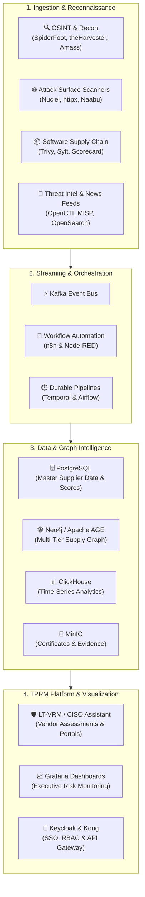

<p align="center">
  
</p>

# 🛡️ Awesome Supplier Risk Management & TPRM Ecosystem

<p align="center">
  <a href="https://github.com/ishandutta2007/Awesome-Awesome-Awesome"></a>
  <a href="https://discord.gg/jc4xtF58Ve"></a>
  <a href="https://github.com/ishandutta2007/Awesome-Supplier-Risk-Management/stargazers"></a>
  <a href="https://github.com/ishandutta2007/Awesome-Supplier-Risk-Management/network/members"></a>
  <a href="https://github.com/ishandutta2007/Awesome-Supplier-Risk-Management/blob/main/LICENSE"></a>
  <a href="https://github.com/ishandutta2007/Awesome-Supplier-Risk-Management/pulls"></a>
  <a href="https://github.com/ishandutta2007"></a>
</p>

> 🚀 **Curated Directory of SaaS Solutions, Open-Source Software, and Architectural Frameworks for Supplier Risk Management (SRM), Third-Party Risk Management (TPRM), Supply Chain Resilience & Continuous Threat Monitoring.**

---

## 📑 Table of Contents

- [🔍 Overview & Industry Scope](#-overview--industry-scope)
- [🏢 SaaS / Hosted Platforms (Ranked by Scale)](#-saashosted-platforms-ranked-by-scale)
- [💻 Open-Source GitHub Projects (Ranked by Stars)](#-open-source-github-projects-ranked-by-stars)
- [🧱 Open-Source Building Blocks Layer](#-open-source-building-blocks-layer)
- [🏗️ Self-Hosted Supplier Risk Architecture](#-self-hosted-supplier-risk-architecture)
- [🧠 9 Essential Supplier Risk Intelligence Layers](#-9-essential-supplier-risk-intelligence-layers)
- [⚖️ Commercial Platform vs. Open-Source Stack](#️-commercial-platform-vs-open-source-stack)
- [🤝 How to Contribute](#-how-to-contribute)
- [📈 Star History](#-star-history)
- [⚠️ Disclaimer](#️-disclaimer)

---

## 🔍 Overview & Industry Scope

**Supplier Risk Management (SRM)** and **Third-Party Risk Management (TPRM)** encompass the complete lifecycle of identifying, assessing, mitigating, and continuously monitoring risks posed by external vendors, contractors, service providers, and multi-tier supply networks.

Modern risk operations cover nine key domains:
1. **🆔 Supplier Discovery & Entity Resolution** – Beneficial ownership, corporate hierarchies, and sanctions screening.
2. **💳 Financial Viability Risk** – Credit health, bankruptcy probability, liquidity distress, and cash-flow risk.
3. **🔒 Cyber & Attack Surface Risk** – Continuous security ratings, vulnerability exposure, CVE tracking, and data leak detection.
4. **⚙️ Operational & Disruption Risk** – Single-source bottlenecks, lead time volatility, and manufacturing downtime.
5. **🌍 Geopolitical & Trade Risk** – Export controls, tariffs, regional sanctions, conflict exposure, and freight disruption.
6. **🌱 ESG, Sustainability & Human Rights** – Scope 3 emissions, CSRD/LkSG compliance, CBAM, and modern slavery auditing.
7. **📜 Regulatory & Compliance Risk** – Anti-bribery (FCPA), GDPR/privacy, ISO standards, and product compliance (PFAS, RoHS, REACH).
8. **📰 Adverse Media & Reputational Risk** – Real-time negative news, fraud investigations, and executive controversies.
9. **🕸️ Multi-Tier Supply Network Graphs** – Tier-2 to Tier-N dependency tracing and fourth-party concentration mapping.

---

## 🏢 SaaS/Hosted Platforms (Ranked by Scale)

> 📊 **Market Size & Industry Structure**: The global Supplier Risk Management & TPRM software market is estimated at **$6.5B – $9.2B in 2026** and projected to surpass **$15.8B by 2032 (~14.5% CAGR)**. The sector is **moderately to highly fragmented** across specialized risk disciplines (e.g., cyber ratings, ESG/sustainability, financial failure scoring, supply-chain network graph mapping, and GRC workflow orchestration) with no single winner-take-all monopoly.

The table below is sorted by **Company Scale (Valuation / Revenue)** in descending order:

| Platform | Company Scale (Valuation / Revenue) | Focus & Key Capabilities | Starting Pricing | Free Tier / Free Trial Limits |
| :--- | :--- | :--- | :--- | :--- |
| **[Moody's](https://www.moodys.com/)** | **~$88B Valuation / ~$6.5B Revenue** (NYSE: MCO) | Global financial intelligence, credit ratings, counterparty risk analytics, and ESG datasets for evaluating supplier financial resilience. | Starts at $15,000/year for entry financial risk data subscriptions | No permanent free tier; provides a complimentary single-company credit/risk assessment report and 14-day temporary evaluation trial for corporate buyers. |
| **[Dun & Bradstreet](https://www.dnb.com/)** | **~$4.5B Market Cap / ~$2.3B Revenue** (NYSE: DNB) | Business data and supplier intelligence provider offering PAYDEX scores, financial failure scores, beneficial ownership, and compliance screening. | D&B Hoovers Essentials starts at $49/month ($529/year); D&B Risk Analytics enterprise tiers start at $5,000 – $10,000/year | 7-day free trial with 150 search/export credits for D&B Hoovers Essentials; complimentary sample supplier portfolio risk scan for enterprise buyers. |
| **[Bureau van Dijk / Moody's Orbis](https://www.bvdinfo.com/)** | **$3.27B Acquisition Value / ~$3.2B Segment Rev** | Global company information database supporting supplier discovery, corporate structures (450M+ entities), financial analysis, ownership research, and PEP/sanctions screening. | Orbis for Salesforce starts at $10,000/year; full enterprise Orbis database licenses start at $20,000 – $40,000/year | No continuous free tier; 14-day corporate and academic trial access with limited export credits (typically 25–50 company records) upon sales approval. |
| **[LRQA](https://www.lrqa.com/)** | **~$1.2B+ Annual Revenue** (Goldman Sachs Asset Mgmt) | Supply chain assurance, ESG audits, cybersecurity inspection, and compliance services with digital tools supporting supplier risk programs. | Starts at $8,000 – $15,000/year for modular SaaS & risk advisory programs (or day-rate audit packages starting at ~$1,500/day) | No perpetual free tier; complimentary 30-minute supply chain risk maturity assessment and preliminary gap report during initial consultation. |
| **[OneTrust Third-Party Risk Management](https://www.onetrust.com/products/third-party-risk-management/)** | **$5.3B Valuation / ~$450M+ ARR** (Series C) | Enterprise third-party risk platform providing vendor onboarding, automated assessments, risk scoring, security questionnaires, and privacy/compliance workflows. | Starts at $10,000/year ($833/month) platform-wide minimum; enterprise TPRM suites start at $25,000 – $40,000/year | Free forever for vendors to maintain trust profiles and answer buyer assessments; 14-day guided trial access for enterprise buyers. |
| **[BitSight](https://www.bitsight.com/)** | **$2.4B Valuation / ~$175M+ ARR** (Moody's backed) | Security ratings and third-party cyber-risk platform offering continuous security assessment, exposure management, and vendor benchmarking. | Starts at $15,000 – $25,000/year for base third-party monitoring tier | Free forever access to BitSight Trust Management Hub for responding to assessments; complimentary 1-time security rating benchmark report; 45-day free access trial via partner programs. |
| **[Sphera](https://sphera.com/)** | **$1.4B Valuation / ~$160M+ Revenue** (Blackstone) | Enterprise risk management platform spanning operational risk, ESG, product stewardship, supply chain sustainability, and environmental health and safety. | Starts at $12,000/year for entry ESG/compliance modules (scales to $24,000+/year for full suite) | 45-day free trial available for Sphera LCA for Experts (Life Cycle Assessment); 14-day guided proof-of-concept for enterprise supply chain suites. |
| **[Exiger](https://www.exiger.com/)** | **$1.2B Valuation / ~$120M+ Revenue** (Carlyle & Insight) | AI-driven supply-chain intelligence platform (1Insight, DDIQ) for supplier discovery, entity resolution, supply-chain mapping, and continuous sanctions/risk screening. | Starts at $25,000/year for core intelligence licenses and search packages; scales to $100,000+/year for enterprise SCRM | No continuous free tier; 14-day guided proof-of-value trial with up to 50 sample entity/supplier risk screenings upon sales consultation. |
| **[EcoVadis](https://ecovadis.com/)** | **$1.0B+ Valuation / ~$160M+ ARR** (Unicorn) | Supplier sustainability ratings and intelligence platform covering environmental, labor/human rights, ethics, carbon emissions, and sustainable procurement. | Starts at €500 – €1,200/year (Basic supplier tier) up to €6,000/year (Corporate tier); Enterprise buyer monitoring starts at ~€15,000/year | Free Carbon Rating assessment & carbon scorecard forever; 6-week free questionnaire completion grace period for invited suppliers prior to submission. |
| **[Assent](https://www.assent.com/)** | **$1.0B+ Valuation / ~$90M+ ARR** (Vista Equity) | Supply-chain sustainability and product compliance platform focused on collecting supplier data, PFAS, REACH, RoHS, and responsible sourcing for complex manufacturers. | Starts at $25,000/year for initial compliance and supplier engagement modules | Free forever portal for suppliers to submit regulatory compliance declarations; 14-day customized evaluation sandbox available upon consultation. |
| **[Altana](https://www.altana.ai/)** | **$1.0B+ Valuation / ~$50M+ ARR** (Series C Unicorn) | Global supply chain network graph (Value Chain Management System) providing multi-tier visibility, trade data, customs flows, and forced labor tracking across suppliers. | Starts at $50,000/year for enterprise deployment (public sector benchmark contracts start at ~£550,000/instance/year) | No self-serve free tier; 30-day proof-of-concept trial with scoped supply-chain graph mapping for qualified enterprise teams. |
| **[Interos](https://www.interos.ai/)** | **$1.0B+ Valuation / ~$50M+ ARR** (Kleiner Perkins / NightDragon) | AI-driven supply-chain and third-party risk intelligence, continuous monitoring, dynamic risk scoring, and multi-tier mapping across financial, cyber, ESG, and geopolitical risks. | Starts at $25,000/year (Base enterprise tier; scales by monitored entities and risk dimensions) | No free tier; 14-to-30-day guided proof-of-concept (PoC) trial available for qualified enterprise evaluations upon sales request. |
| **[SecurityScorecard](https://securityscorecard.com/)** | **$1.0B+ Valuation / ~$120M+ ARR** (Unicorn) | Cybersecurity ratings and continuous third-party cyber-risk monitoring platform providing external security grades, attack surface monitoring, and vendor questionnaires. | Starts at $1,999/month (~$20,000/year) for paid Business editions monitoring 20+ domains | Free Forever plan with 1 self-monitored domain scorecard and basic risk insights; 14-day free trial of Business Edition (monitors up to 5 vendor scorecards, no credit card required). |
| **[apexanalytix](https://www.apexanalytix.com/)** | **~$900M Valuation / ~$85M+ Revenue** (KKR backed) | Supplier risk, bank account validation (smartVM), and procure-to-pay integrity platform focused on fraud detection, compliance controls, and recovery audit. | Starts at $20,000/year for supplier portal modules (or hybrid fixed + contingent fee models for recovery audits) | Free forever portal for suppliers to validate banking and tax info; complimentary initial supplier master data health check scan for enterprise buyers. |
| **[ProcessUnity](https://www.processunity.com/)** | **~$650M Valuation / ~$75M+ ARR** (Marlin Equity) | Cloud-based TPRM and GRC platform supporting vendor onboarding, assessments, questionnaires, risk scoring, remediation, and continuous monitoring. | Starts at $25,000/year for SMB and emerging enterprise tiers | Free forever tier for vendors on the Global Risk Exchange to complete and share risk assessments; 30-day proof-of-concept trial sandbox for buyers. |
| **[Aravo](https://www.aravo.com/)** | **~$400M Valuation / ~$50M+ ARR** (FTV Capital) | Enterprise third-party risk management platform supporting supplier onboarding, due diligence, risk scoring, lifecycle management, and regulatory compliance. | QuickStart packages start at $50,000 (includes 60-day rapid implementation); ongoing software licenses start at $30,000/year | Free forever access for suppliers to submit onboarding due diligence data; 14-to-30-day proof-of-concept sandbox trial upon qualification. |
| **[Prewave](https://www.prewave.com/)** | **~$350M (€320M) Valuation / ~$30M+ ARR** (Series B) | AI-powered supply-chain intelligence and supplier-risk platform focused on early-warning signals, LkSG/CSRD compliance, ESG risk, geopolitical disruptions, and supplier resilience. | Starts at €10,000/year (~$11,000/year) for standard continuous supplier monitoring | Free forever plan for suppliers on the Prewave Supplier Network (allows suppliers to assess/improve profile and compliance score at no cost); 14-day guided trial for buyers upon demo request. |
| **[IntegrityNext](https://www.integritynext.com/)** | **~$300M (€275M) Valuation / ~$25M+ ARR** (EQT Growth) | Supplier sustainability, ESG, and regulatory compliance platform used to assess suppliers against LkSG, CSRD, CBAM, environmental, and human rights requirements. | Starts at €9,800/year (~$10,500/year) for buyer platform access and compliance monitoring | Free forever for suppliers to register, complete compliance questionnaires, and share sustainability profiles; 14-day free trial account available for evaluating buyer compliance modules. |
| **[Black Kite](https://blackkite.com/)** | **~$250M Valuation / ~$30M+ ARR** (Volition Capital) | Non-intrusive cyber risk intelligence platform delivering external security ratings, Ransomware Susceptibility Index (RSI), and FAIR risk quantification. | Starts at $15,000/year for base third-party monitoring tier (median enterprise contract ~$29,160/year) | No free forever plan; 14-day guided proof-of-concept trial allowing monitoring of up to 5 third-party domains upon request. |
| **[UpGuard](https://www.upguard.com/)** | **~$250M Valuation / ~$35M+ ARR** (Pelion / August) | Third-party risk (Vendor Risk) and external attack surface management (BreachSight) providing automated security questionnaires and continuous ratings. | Starter plan starts at $1,750/month (billed annually at $21,000/year) for monitoring up to 50 vendors | Free Forever plan monitoring up to 5 vendors with Trust Exchange AI questionnaire builder; 14-day free trial of Vendor Risk and BreachSight paid plans. |
| **[Prevalent](https://www.prevalent.net/)** | **~$200M Valuation / ~$35M+ ARR** (Mitratech / Insight) | Third-party risk management platform providing supplier discovery, questionnaires, assessments, continuous monitoring, and risk intelligence. | Starts at $25,000/year for entry vendor risk management tiers (up to 25–50 assessed suppliers) | Free forever access for suppliers to complete assessments and store evidence in the Prevalent Vendor Network; 14-day evaluation trial for enterprise teams. |
| **[CyberGRX](https://www.processunity.com/cybergrx/)** | **~$200M Valuation / ~$25M+ ARR** (ProcessUnity) | Third-party cyber-risk exchange delivering standardized, validated risk assessments and dynamic threat-profiling data on global vendors. | Starts at $15,000/year for access to exchange assessment tiers | Free forever for third parties to complete their assessment and share it across the exchange; 14-day trial access for buyers to explore pre-assessed vendors. |
| **[Resilinc](https://www.resilinc.com/)** | **~$200M Valuation / ~$30M+ ARR** (Vista Equity) | Supply-chain resilience platform offering multi-tier supplier mapping, EventWatch AI disruption monitoring, supplier assessments, and collaborative response management. | Starts at $1,400/month ($16,800/year) for entry monitoring packages | Free forever for suppliers to register, map parts/sites, and maintain resilience profiles on the network; 30-day proof-of-value trial for enterprise buyers. |
| **[Everstream Analytics](https://www.everstream.ai/)** | **~$180M Valuation / ~$25M+ ARR** (Morgan Stanley Exp) | Predictive supply-chain analytics platform providing disruption monitoring, supplier risk mapping, weather/logistics risk, and resilience insights across global supply networks. | Starts at $1,500/month ($18,000/year) for SMB Quick-Start tiers; enterprise packages scale by network size | No free forever plan; 14-day guided proof-of-concept sandbox trial with sample supply-chain disruption feeds upon qualification. |
| **[RapidRatings](https://www.rapidratings.com/)** | **~$150M Valuation / ~$25M+ ARR** (Growth Equity) | Financial health and supplier risk intelligence platform assessing financial stability, credit risk, and default probability of private and public companies via FHR scores. | Starts at $10,000/year for initial company rating packs (enterprise bundles scale up to $70,000+/year) | No continuous free tier; complimentary 1-time Financial Health Rating (FHR) sample company assessment report provided during sales evaluation. |
| **[Venminder](https://www.venminder.com/)** | **~$140M Valuation / ~$25M+ ARR** (Silversmith) | Vendor risk management platform focused on vendor due diligence, questionnaires, document management, risk assessments, and ongoing monitoring. | Starts at $12,000/year ($1,000/month) for software-only subscriptions; managed assessment bundles start at ~$25,000/year | Free forever Venminder Exchange account (enables searching and ordering third-party assessment guides); 14-day sandbox access upon sales demo. |
| **[Whistic](https://www.whistic.com/)** | **~$120M Valuation / ~$20M+ ARR** (Emergence Capital) | Dual-sided vendor security network enabling standardized security profiles, Whistic Trust Centers, and automated assessment intake. | Starts at $12,000/year for Core platform tier | Free Basic Profile forever for vendors to create and publish a Whistic Trust Center; 14-day free trial for AI Compliance Automation features. |
| **[Panorays](https://www.panorays.com/)** | **~$120M Valuation / ~$20M+ ARR** (Greenfield Partners) | Third-party cyber-risk management platform providing automated assessments, security ratings, supplier monitoring, and risk remediation. | Starts at $15,000/year ($1,250/month) for monitoring up to 25 vendors | Free Starter Plan forever (unlimited duration, assess up to 5 third-party vendors, view internal posture rating); 14-day full-featured enterprise trial. |
| **[Source Intelligence](https://www.sourceintelligence.com/)** | **~$100M Valuation / ~$20M+ ARR** (Horizon Capital) | Supply-chain compliance and supplier intelligence platform covering ESG, responsible sourcing, Conflict Minerals, REACH, RoHS, and supplier data validation. | Starts at $10,000/year (or ~$1,200/month per module) for core regulatory compliance tracking | Free forever access for invited suppliers to complete assessments and upload documentation; 14-day trial walkthrough available upon request. |
| **[Craft](https://craft.co/)** | **~$65M Valuation / ~$15M+ ARR** (High Alpha) | Company and supply-chain intelligence platform providing business information, supplier discovery, risk intelligence, and corporate data. | Craft.co data integrations (e.g. Salesforce App) start at $10,000/company/year; basic web intelligence subscriptions start at $250/month ($3,000/year) | Free basic web search tier with up to 5 company profile views/month; 14-day enterprise trial available upon request. |
| **[Sedex](https://www.sedex.com/)** | **~$50M (£40M) Annual Revenue** (Membership Org) | Supplier sustainability and responsible-sourcing platform providing supplier assessments, SMETA audits, risk intelligence, and supply-chain sustainability data. | Supplier site membership starts at £215 – £224/year per site; Buyer membership starts at ~£6,471/year | No permanent free tier; 14-day evaluation access / guided walkthrough provided for prospective buyer members during sales scoping. |

---

## 💻 Open-Source GitHub Projects (Ranked by Stars)

The following open-source tools, TPRM systems, attack surface scanners, graph engines, and supply chain security frameworks are sorted by **GitHub Star Counts** in descending order:

1. **[n8n](https://github.com/n8n-io/n8n)** [](https://github.com/n8n-io/n8n/stargazers) — Fair-code workflow automation platform with native AI capabilities, ideal for automating supplier onboarding pipelines, assessment routing, and webhook alerts.
2. **[Grafana](https://github.com/grafana/grafana)** [](https://github.com/grafana/grafana/stargazers) — Interactive analytics and risk visualization platform for real-time supplier monitoring dashboards, compliance metrics, and incident alerts.
3. **[Redis](https://github.com/redis/redis)** [](https://github.com/redis/redis/stargazers) — High-performance in-memory cache and vector store for sub-millisecond retrieval of supplier risk scores, session tokens, and alert thresholds.
4. **[MinIO](https://github.com/minio/minio)** [](https://github.com/minio/minio/stargazers) — S3-compatible high-performance object storage for securely archiving supplier SOC 2 reports, ISO certificates, audit evidence, and signed contracts.
5. **[ClickHouse](https://github.com/ClickHouse/ClickHouse)** [](https://github.com/ClickHouse/ClickHouse/stargazers) — Column-oriented analytical database management system for processing billions of real-time supplier events, transactions, and telemetry data.
6. **[Apache Airflow](https://github.com/apache/airflow)** [](https://github.com/apache/airflow/stargazers) — Scalable workflow orchestration platform for programmatically scheduling batch supplier data ingestion, Sanctions/PEP screening jobs, and risk scoring pipelines.
7. **[Kong](https://github.com/Kong/kong)** [](https://github.com/Kong/kong/stargazers) — Cloud-native API Gateway providing security, rate limiting, and authentication for third-party risk assessment integrations and webhook endpoints.
8. **[Trivy](https://github.com/aquasecurity/trivy)** [](https://github.com/aquasecurity/trivy/stargazers) — Comprehensive security scanner for container images, filesystems, Git repositories, SBOM generation, and software supply chain vulnerabilities.
9. **[Keycloak](https://github.com/keycloak/keycloak)** [](https://github.com/keycloak/keycloak/stargazers) — Open-source identity and access management (IAM) providing Single Sign-On (SSO), OAuth2/OIDC, and role-based access for vendor portals.
10. **[Apache Kafka](https://github.com/apache/kafka)** [](https://github.com/apache/kafka/stargazers) — High-throughput distributed event streaming platform for streaming continuous supplier risk signals, news events, and security telemetry.
11. **[Nuclei](https://github.com/projectdiscovery/nuclei)** [](https://github.com/projectdiscovery/nuclei/stargazers) — Fast, template-based vulnerability and exposure scanner for validating external supplier attack surfaces and verifying third-party posture.
12. **[Node-RED](https://github.com/node-red/node-red)** [](https://github.com/node-red/node-red/stargazers) — Low-code visual event-driven programming tool for connecting supplier APIs, hardware sensors, ERP systems, and notification channels.
13. **[Temporal](https://github.com/temporalio/temporal)** [](https://github.com/temporalio/temporal/stargazers) — Microsecond-to-month durable execution engine for orchestrating mission-critical supplier onboarding, audit follow-ups, and corrective action workflows.
14. **[PostgreSQL](https://github.com/postgres/postgres)** [](https://github.com/postgres/postgres/stargazers) — Enterprise-grade relational database serving as the primary datastore for supplier master data, risk registers, questionnaires, and audit trails.
15. **[SpiderFoot](https://github.com/smicallef/spiderfoot)** [](https://github.com/smicallef/spiderfoot/stargazers) — Automated OSINT reconnaissance platform for gathering supplier threat intelligence, exposed credentials, network ranges, and digital footprints.
16. **[Katana](https://github.com/projectdiscovery/katana)** [](https://github.com/projectdiscovery/katana/stargazers) — Next-generation crawling and spidering framework for discovering and enumerating external supplier web assets and shadow endpoints.
17. **[theHarvester](https://github.com/laramies/theHarvester)** [](https://github.com/laramies/theHarvester/stargazers) — OSINT tool for gathering supplier domain names, employee email addresses, virtual hosts, and open ports from public search engines.
18. **[Neo4j](https://github.com/neo4j/neo4j)** [](https://github.com/neo4j/neo4j/stargazers) — Native graph database for mapping multi-tier supplier relationships (Tier-1 to Tier-N), ultimate beneficial ownership (UBO), and concentration risks.
19. **[Wazuh](https://github.com/wazuh/wazuh)** [](https://github.com/wazuh/wazuh/stargazers) — Unified XDR and SIEM platform for continuous security monitoring, integrity auditing, and compliance verification across third-party environments.
20. **[Semgrep](https://github.com/semgrep/semgrep)** [](https://github.com/semgrep/semgrep/stargazers) — Fast static analysis engine for finding vulnerabilities, enforcing supply chain guardrails, and auditing third-party code packages.
21. **[OWASP Amass](https://github.com/owasp-amass/amass)** [](https://github.com/owasp-amass/amass/stargazers) — In-depth network mapping and external asset discovery tool for mapping supplier internet presence and identifying exposed digital assets.
22. **[Subfinder](https://github.com/projectdiscovery/subfinder)** [](https://github.com/projectdiscovery/subfinder/stargazers) — Fast passive subdomain enumeration tool for discovering valid subdomains of third-party vendors without triggering IDS/WAF alerts.
23. **[OpenSearch](https://github.com/opensearch-project/OpenSearch)** [](https://github.com/opensearch-project/OpenSearch/stargazers) — Distributed search and analytics engine for real-time indexing of adverse media, PEP news feeds, supplier contracts, and threat events.
24. **[Grype](https://github.com/anchore/grype)** [](https://github.com/anchore/grype/stargazers) — Fast vulnerability scanner for container images and filesystems, enabling automated software supplier vulnerability assessments.
25. **[httpx](https://github.com/projectdiscovery/httpx)** [](https://github.com/projectdiscovery/httpx/stargazers) — High-speed HTTP probing toolkit for checking uptime, TLS certificate expiration, technology stacks, and response codes across supplier web servers.
26. **[OpenCTI](https://github.com/OpenCTI-Platform/opencti)** [](https://github.com/OpenCTI-Platform/opencti/stargazers) — Cyber threat intelligence knowledge management platform for correlating threat actors, CVEs, and Indicators of Compromise (IoCs) affecting vendors.
27. **[Syft](https://github.com/anchore/syft)** [](https://github.com/anchore/syft/stargazers) — CLI tool and library for generating comprehensive Software Bill of Materials (SBOM) in SPDX and CycloneDX formats from supplier packages.
28. **[OpenTelemetry Collector](https://github.com/open-telemetry/opentelemetry-collector)** [](https://github.com/open-telemetry/opentelemetry-collector/stargazers) — Vendor-agnostic telemetry ingestion proxy for capturing metrics, traces, and operational logs from distributed supplier monitoring agents.
29. **[MISP](https://github.com/MISP/MISP)** [](https://github.com/MISP/MISP/stargazers) — Open-source threat intelligence and information-sharing platform for exchanging cyber risk data and vulnerability indicators across trusted networks.
30. **[Cosign](https://github.com/sigstore/cosign)** [](https://github.com/sigstore/cosign/stargazers) — Container signing, verification, and transparency tool ensuring software delivered by third-party suppliers is tamper-proof.
31. **[Naabu](https://github.com/projectdiscovery/naabu)** [](https://github.com/projectdiscovery/naabu/stargazers) — Fast SYN/CONNECT port scanner for evaluating exposed services and ports on supplier infrastructure.
32. **[OpenSSF Scorecard](https://github.com/ossf/scorecard)** [](https://github.com/ossf/scorecard/stargazers) — Automated security health metrics and supply chain risk evaluation for open-source software dependencies and upstream repositories.
33. **[DefectDojo](https://github.com/DefectDojo/django-DefectDojo)** [](https://github.com/DefectDojo/django-DefectDojo/stargazers) — Open-source vulnerability management, DevSecOps orchestration, and Application Security Posture Management (ASPM) platform.
34. **[Greenbone OpenVAS Scanner](https://github.com/greenbone/openvas-scanner)** [](https://github.com/greenbone/openvas-scanner/stargazers) — Network vulnerability scanner for evaluating security weaknesses and unpatched services across authorized third-party endpoints.
35. **[Apache AGE](https://github.com/apache/age)** [](https://github.com/apache/age/stargazers) — PostgreSQL graph extension for modeling and querying multi-tier supplier relationship graphs (openCypher) directly inside PostgreSQL.
36. **[CISO Assistant](https://github.com/intuitem/ciso-assistant-community)** [](https://github.com/intuitem/ciso-assistant-community/stargazers) — Open-source GRC platform supporting 150+ frameworks (ISO 27001, SOC 2, NIS2, DORA, GDPR), third-party risk management (TPRM), controls, and evidence tracking.
37. **[OpenCVE](https://github.com/opencve/opencve)** [](https://github.com/opencve/opencve/stargazers) — Tailored CVE alert platform allowing security teams to subscribe to specific vendor tech stacks and receive real-time vulnerability notifications.
38. **[GUAC (Graph for Understanding Artifact Composition)](https://github.com/guacsec/guac)** [](https://github.com/guacsec/guac/stargazers) — Supply chain security knowledge graph that aggregates SBOMs, SLSA attestations, Scorecards, and vulnerabilities to analyze dependency risks.
39. **[OWASP Maryam](https://github.com/saeeddhqan/Maryam)** [](https://github.com/saeeddhqan/Maryam/stargazers) — Open-source intelligence (OSINT) framework for collecting information from public search engines, social media, and domain databases.
40. **[in-toto](https://github.com/in-toto/in-toto)** [](https://github.com/in-toto/in-toto/stargazers) — Framework for securing the integrity of software supply chains by verifying that each step from code commit to deployment was executed by authorized parties.
41. **[SLSA Verifier](https://github.com/slsa-framework/slsa-verifier)** [](https://github.com/slsa-framework/slsa-verifier/stargazers) — Tool for verifying SLSA (Supply-chain Levels for Software Artifacts) provenance and build integrity for third-party software artifacts.
42. **[SimpleRisk](https://github.com/simplerisk/code)** [](https://github.com/simplerisk/code/stargazers) — Simple, intuitive enterprise risk management and GRC software supporting risk assessments, governance, and third-party risk extensions.
43. **[Eramba](https://github.com/eramba/docker)** [](https://github.com/eramba/docker/stargazers) — Open-source Governance, Risk & Compliance (GRC) framework for internal controls, risk management, and vendor assessment workflows.
44. **[LT-VRM](https://github.com/learntprm-design/lt-vrm)** [](https://github.com/learntprm-design/lt-vrm/stargazers) — Dedicated open-source Third-Party Risk Management platform featuring vendor onboarding, security questionnaires, 0–1000 risk scoring, contracts, breach monitoring, and vendor self-service portals.

---

## 🧱 Open-Source Building Blocks Layer

| Architectural Layer | Open-Source Technologies | Strategic Role & Responsibility |
| :--- | :--- | :--- |
| **🛡️ Dedicated TPRM Platform** | `LT-VRM`, `CISO Assistant` | Vendor lifecycle management, questionnaires, assessment scoring, vendor trust portal |
| **📜 GRC & Risk Governance** | `CISO Assistant`, `SimpleRisk`, `Eramba` | Compliance framework mapping (ISO 27001, NIS2, DORA), risk registers, control audits |
| **🕸️ Multi-Tier Graph** | `Neo4j`, `Apache AGE`, `GUAC` | Multi-tier supply chain dependency mapping, concentration risk, and ownership hierarchies |
| **🔍 OSINT Reconnaissance** | `SpiderFoot`, `OWASP Amass`, `theHarvester`, `Maryam` | Public digital footprint discovery, domain intelligence, exposed assets, and credentials |
| **🌐 Attack Surface Monitoring** | `Nuclei`, `httpx`, `Subfinder`, `Naabu`, `Katana` | Continuous external vulnerability scanning, open port checks, and web service probing |
| **🕵️ Cyber Threat Intel (CTI)** | `OpenCTI`, `MISP` | Threat actor correlation, IoC sharing, vendor breach indicators, and dark-web intelligence |
| **📦 Software Supply Chain** | `Trivy`, `Syft`, `Grype`, `Cosign`, `Scorecard`, `in-toto` | SBOM generation, vulnerability scanning, code signing, and SLSA provenance validation |
| **🔎 Search & Adverse Media** | `OpenSearch` | Full-text indexing of sanctions lists, regulatory news, adverse media, and audit filings |
| **📊 Risk Data Analytics** | `ClickHouse` | High-throughput aggregation and analytics of continuous monitoring telemetry |
| **🗄️ Relational Master Data** | `PostgreSQL` | System of record for supplier profiles, risk scores, questionnaires, and audit logs |
| **⚡ Low-Latency Cache** | `Redis` | Real-time score caching, session tokens, rate limits, and alert triggers |
| **🔄 Workflow Automation** | `n8n`, `Node-RED` | Automated onboarding workflows, reminder notifications, webhook routing, and alerts |
| **⏱️ Durable Orchestration** | `Apache Airflow`, `Temporal` | Long-running risk assessment workflows, batch screening pipelines, and task retries |
| **📈 Executive Dashboards** | `Grafana` | Real-time executive risk dashboards, SLA tracking, and trend analysis |
| **📁 Secure Evidence Storage** | `MinIO` | Tamper-evident storage for vendor SOC 2 reports, ISO certificates, and legal contracts |
| **🔐 Identity & Access (SSO)** | `Keycloak` | Supplier authentication, OAuth2/OIDC, Multi-Factor Authentication, and RBAC |
| **🚪 API Gateway** | `Kong` | Gateway routing, rate limiting, and mTLS security for third-party integrations |
| **📡 Event Streaming** | `Apache Kafka` | Real-time publish-subscribe backbone for streaming supply chain risk triggers |
| **🔭 System Observability** | `OpenTelemetry Collector` | Distributed telemetry collection and health monitoring for risk data pipelines |

---

## 🏗️ Self-Hosted Supplier Risk Architecture

Organizations seeking a sovereign, self-hosted alternative to expensive SaaS platforms can deploy an integrated open-source stack:



---

## 🧠 9 Essential Supplier Risk Intelligence Layers

```
                                  ┌────────────────────────┐
                                  │ 1. Supplier Identity   │ (Entity Resolution, UBO, Locations)
                                  ├────────────────────────┤
                                  │ 2. Financial Viability │ (Credit Health, Bankruptcy Risk, FHR)
                                  ├────────────────────────┤
                                  │ 3. Cyber & Sec Ratings │ (External Attack Surface, CVEs, SSL)
                                  ├────────────────────────┤
                                  │ 4. Operational Risk    │ (Single-Source, Capacity, Lead Times)
                                  ├────────────────────────┤
          Supplier Risk           │ 5. Geopolitical Risk   │ (Export Bans, Tariffs, Country Risk)
          Intelligence            ├────────────────────────┤
          Stack                   │ 6. ESG & Sustainability│ (CSRD, LkSG, Carbon, Human Rights)
                                  ├────────────────────────┤
                                  │ 7. Regulatory Risk     │ (Sanctions, PEP, PFAS, RoHS, REACH)
                                  ├────────────────────────┤
                                  │ 8. Adverse Media       │ (Real-Time Negative News, Fraud)
                                  ├────────────────────────┤
                                  │ 9. Multi-Tier Graph    │ (Tier-2+ Dependencies, Shared Nodes)
                                  └────────────────────────┘
```

---

## ⚖️ Commercial Platform vs. Open-Source Stack

| Evaluation Criteria | 🏢 Commercial SaaS Platform | 💻 Open-Source Stack |
| :--- | :--- | :--- |
| **🚀 Time to Deployment** | Fast (days to weeks via turnkey SaaS) | Moderate (requires initial architecture & config) |
| **💰 Annual Licensing Cost** | $15,000 to $100,000+/year subscription | $0 software licensing (infrastructure costs only) |
| **🔒 Data Privacy & Sovereignty** | Data hosted in vendor multi-tenant cloud | 100% self-hosted; on-prem or private cloud |
| **🌐 Proprietary Threat Feeds** | Included (pre-curated rating data) | Requires integration of open/custom data feeds |
| **🛠️ Customizability & Extensibility** | Limited to vendor UI and standard APIs | Fully customizable down to database and code level |
| **🕸️ Multi-Tier Graph Control** | Vendor-defined graph algorithms | Unlimited custom graph queries with Neo4j / AGE |
| **📜 Compliance Questionnaire Engine** | Turnkey standardized questionnaires | Self-configured via LT-VRM / CISO Assistant |
| **🔄 Workflow & Integration Flexibility**| Built-in webhooks & connector marketplace | Infinite automation options via n8n & Temporal |

---

## 🤝 How to Contribute

Contributions are welcome! Please help keep this curated guide comprehensive and factual.

1. **Fork the Repository** on GitHub.
2. **Add or update an entry** in `README.md` following the established table structure and sorting criteria.
3. For open-source tools, include the repository URL and social star badge.
4. For SaaS tools, specify realistic starting tier pricing and explicit free tier / free trial limits (never use placeholders like "N/A" or "Custom").
5. **Open a Pull Request** with a brief summary of the changes.

---

## 📈 Star History

[](https://star-history.dera.page/#ishandutta2007/Awesome-Supplier-Risk-Management&type=date&legend=top-left)

---

## ⚠️ Disclaimer

This repository is a community-maintained index for educational, research, and technical evaluation purposes. Mention of commercial products or open-source projects does not constitute an endorsement. Commercial pricing, features, and corporate valuations change over time; always confirm terms directly with individual vendors.